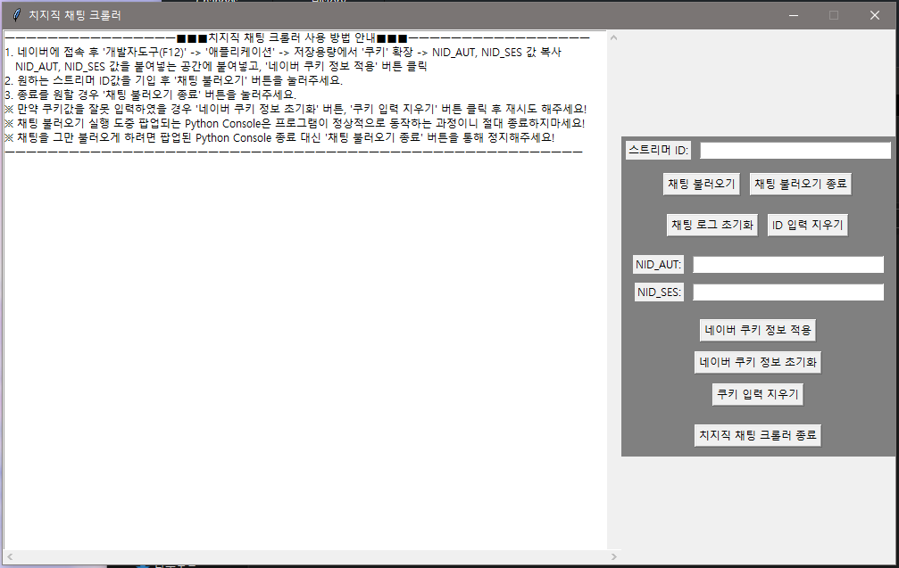

# Chzzk Chat Crawler

  

  

파이썬을 통해 네이버 치지직 서비스의 채팅을 크롤링 해봅시다.

이 코드는 Buddha7771님께서 작성하신 코드입니다!

[kimcore](https://github.com/kimcore/chzzk/tree/main)님의 코드를 기반으로 작성된 코드에 Tkinter를 통한 GUI를 적용한 코드입니다.

자세한 변경사항이 궁금하시면 [GIT_Graph](https://github.com/WoongJiKang/ChzzkChat_GUI.ver/network) << 클릭해서 확인해주세요!

## 설치

    # 코드 다운로드
    $ git clone https://github.com/WoongJiKang/ChzzkChat_GUI.ver .
    $ 터미널, 명령 프롬프트에서 "cd 디렉토리"를 통해 ChzzkChat_GUI.ver 로 이동해주세요!

    # 가상환경 설치
    $ conda create -n chzzk python=3.9
    $ conda activate chzzk

    # 패키지 설치
    $ pip install -r requirements.txt

## 사용하기

> start.pyw 파일을 python3 형식으로 실행시켜주세요!

> 출력 내용은 자동으로 chat.log에 저장됩니다!

> 추가적인 기능은 프로그램 내부에서 확인해주세요!
